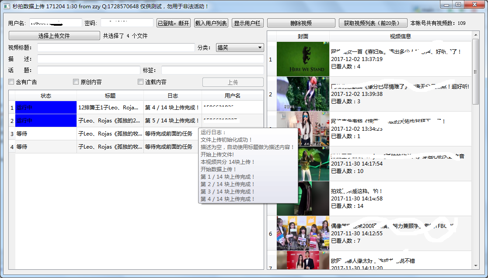

秒拍号视频上传工具  
=====
[最新版下载地址](https://pan.baidu.com/s/1eRR2PSA#list/path=%2F)  
# 功能：
	1. 使用官方的上传接口，将本地视频上传至服务器，对官方中所有的选项都可以使用。
	2. 可对最近上传的视频进行删除，预览。  
	3. 自动选择与文件名同名图片 或 自动生成视频封面并上传。  
	4. 选中多文件可同时上传，或在队列中等待上传。  
	5. 对正在上传及完成的视频进行实时监控。
 
# 后续可能增加的功能  
    1. 选中多条记录后，多帐号自动切换。  
    2. 对视频名称重复的，自动更改文件名。
    3. 对用户信息的查找显示，如头像、城市、粉丝数...
    4. 站点内信阅读提示。
# 适用系统：
`WIN7及以上64位系统`
# 更新日志
## 171208 
    1. 修正：多次选择上传文件时，线程控制失效问题。
    2. 增加：单独关闭某几个线程的功能。
    3. 优化：更改线程数量将对未启动的线程实时起做用。
    4. 优化：增加获取封面的等待时间。
## 171207  
    1. 增加：新版本自动检测功能。
    2. 修正：载入用户列表，有时需要手工显示列表问题。

## 171206:
    1. 修正：因载入用户列表造成上传完成时软件崩溃问题。
    2. 优化：话题及标签可用中英文逗号分割。
    3. 优化：部分日志精简显示。
    4. 增加：操作帮助简要文档。
    5. 增加：标签及话题自动记忆功能。
    6. 增加：对出现上传个数有限制异常的处理。
    7. 增加：可自己选择同时进行的线程。

## 171205：
    1. 修正：修复视频上传视频时容易崩溃的问题。

## 171204
    1. 修正：使用中文名称时容易出现上传失败的问题。
    2. 增加功能：可隐藏用户列表，视觉效果会好些。

## 171203
    1. 增加功能：可选择多个文件，点击上传时会同时上传。
    2. 增加功能：多文件同时上传时增加队列功能，超过限定数量的任务的将会等待。
    3. 增加功能：自动记忆上次使用的路径、用户名、密码。
    4. 修正：解决导入用户列表时容易卡死问题。
    5. 增加功能：增加对队列中的任务实时监控的功能。
    6. 优化：各表格显示的视觉效果

## 171202  
    1. 修正：因网址未编码会出现太多次重试的问题。  
    2. 修正：选择文件后，再次选择文件时未进行选择出现的闪退。
    3. 修正：content-type对各请求使用单独的。   

## 171201:
    1. 增加功能：如标题为空自动提取文件名为标题名称。
    2. 增加功能：如视频目录下有与视频名称相同的图片则直接做为视频封面，如果没有则提取秒拍封面图片。

